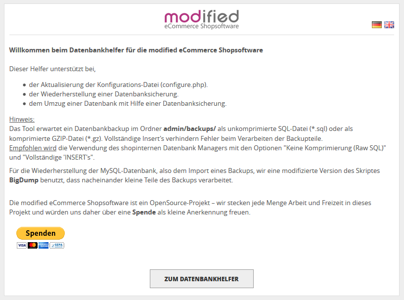
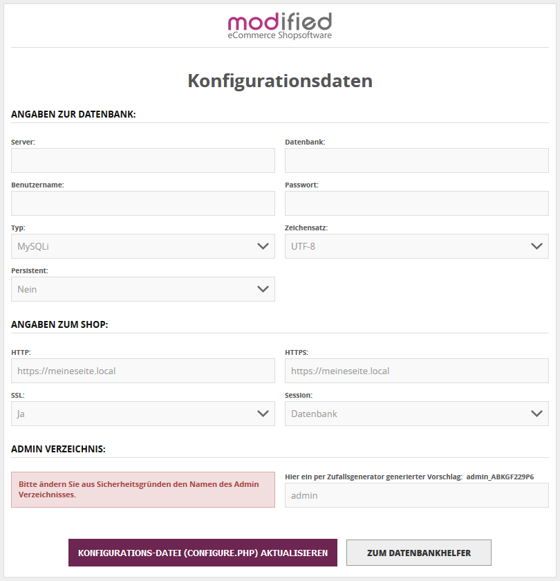
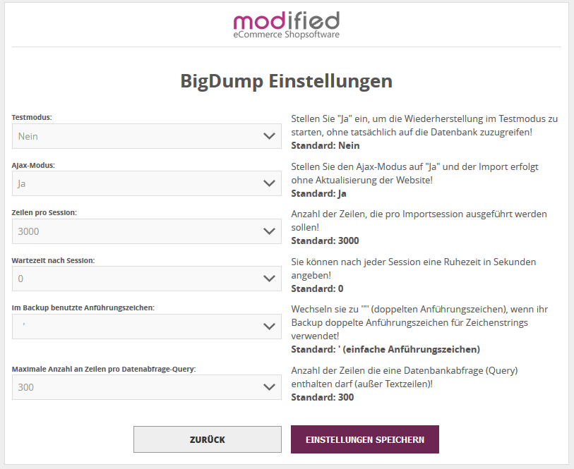
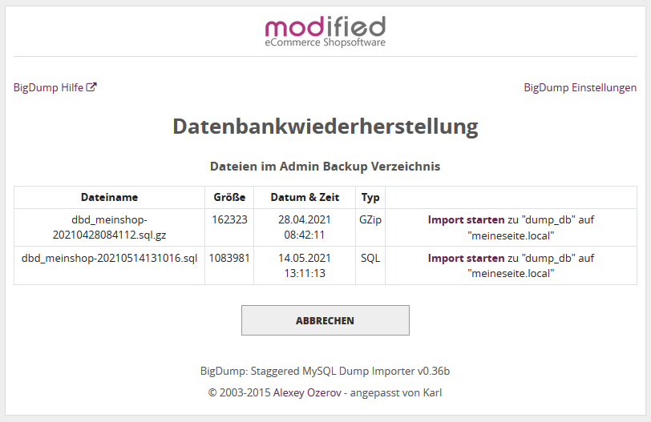
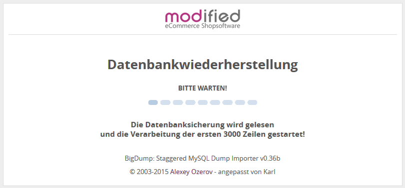
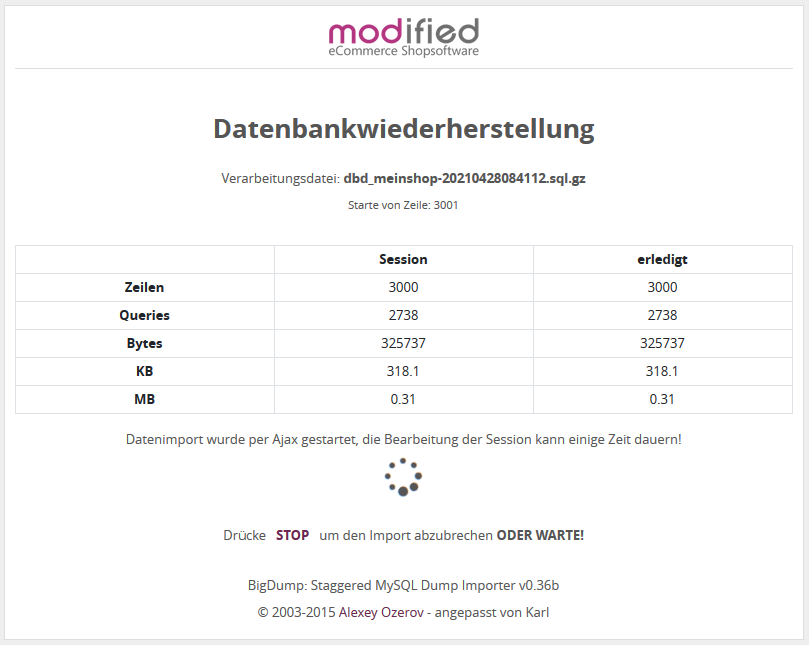
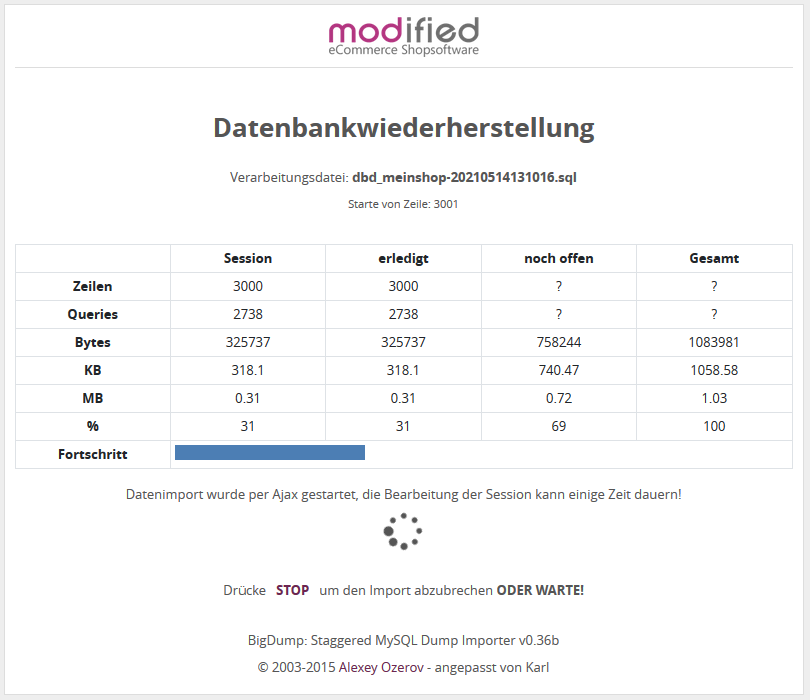
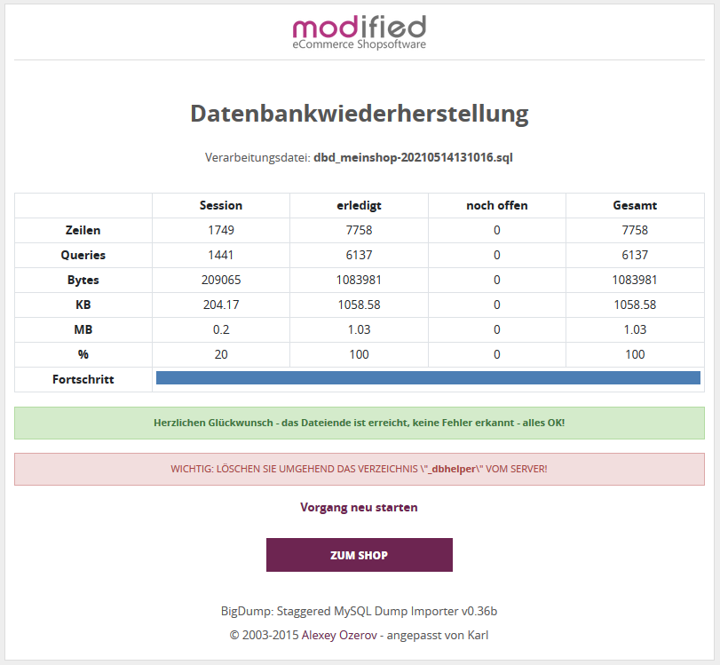

# Datenbankhelfer für die modified eCommerce Shopsoftware

Voraussetzung: Modified eCommerce Shopsoftware - Version ab 2.0.5.0

## Installation und Start des Helfers

Im Verzeichnis **new_files** befindet sich der Ordner **_dbhelper**.
Diesen Ordner mit allen Dateien in den Shoproot kopieren.
Anschließend im Browser **meinshop.de/_dbhelper/** aufrufen.

## Allgemeines

Dieser Helfer unterstützt bei,

- der Aktualisierung der Konfigurations-Datei (configure.php).
- der Wiederherstellung einer Datenbanksicherung.
- dem Umzug einer Datenbank mit Hilfe einer Datenbanksicherung.

*Hinweis:*
Das Tool erwartet ein Datenbankbackup im Ordner **admin/backups/** als unkomprimierte SQL-Datei (*.sql) oder als komprimierte GZIP-Datei (*.gz). Vollständige Insert's verhindern Fehler beim Verarbeiten der Backupteile.
Empfohlen wird die Verwendung des shopinternen Datenbank Managers mit den Optionen "Keine Komprimierung (Raw SQL)" und "Vollständige 'INSERT's".

Für die Wiederherstellung der MySQL-Datenbank, also dem Import eines Backups, wir eine modifizierte Version des Skriptes **BigDump** benutzt, dass nacheinander kleine Teile des Backups verarbeitet.

## Konfigurationsdaten

Hier besteht die Möglichkeit die Konfigurationsdatei **includes/configure.php** zu aktualisieren.
Die Daten aus der Konfigurationsdatei werden in Datenbankwiederherstellung übernommen.

## BigDump Einstellungen

Hier können die BigDump Einstellungen verändert werden.

## Datenbankwiederherstellung

Die Startseite der Datenbankwiederherstellung zeigt alle vorhanden Sicherungen im Backupordner (Standard: "admin/backups").

Durch Klick auf den entsprechenden Link **Import starten** wird die Wiederherstellung begonnen.

**Das Skript arbeitet schrittweise** alle SQL-Anweisungen der Backupdatei ab.
Die Sicherungsdatei kann komprimierte Dateien

und unkomprimierte Dateien verabreiten

Die Abschlußmeldung zeigt eine Zusammenfassung der Wiederherstellung

 
Viel Spaß! 
Karl
